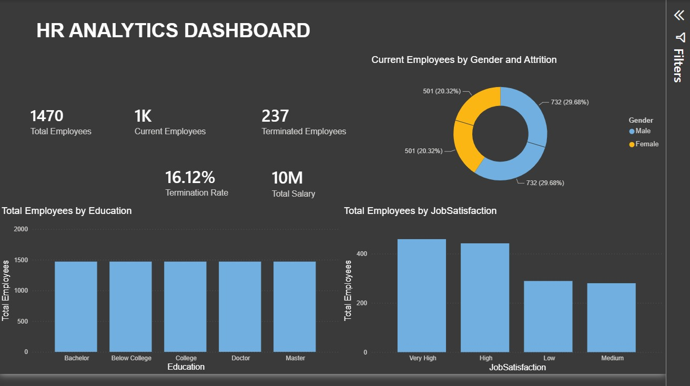

# 👥 HR Analytics Dashboard

## 📊 Power BI Dashboard

An interactive **HR Analytics Dashboard** developed in Power BI to analyze employee demographics, workforce composition, employee satisfaction, education levels, salary, and employee attrition.

The dashboard provides a comprehensive overview of the organization's workforce and helps identify key HR metrics and patterns.

---

## 🖼️ Dashboard Preview



---

## 🎯 Project Objective

The main objective of this project is to transform employee data into meaningful HR insights through an interactive Power BI dashboard.

The analysis focuses on:

- Employee headcount
- Current vs. terminated employees
- Employee termination rate
- Total salary
- Gender distribution
- Employee education
- Job satisfaction
- Workforce composition
- Employee attrition analysis

---

## 📌 Key Performance Indicators

| KPI | Value |
|---|---:|
| **Total Employees** | 1,470 |
| **Current Employees** | 1K |
| **Terminated Employees** | 237 |
| **Termination Rate** | 16.12% |
| **Total Salary** | 10M |

---

## 📈 Dashboard Features

### 1. Current Employees by Gender and Attrition

The donut chart provides an overview of employee distribution based on:

- Gender
- Current employment status
- Attrition/termination

This visualization helps understand workforce composition and employee attrition patterns.

---

### 2. Total Employees by Education

The dashboard analyzes employee distribution across different education levels:

- Below College
- College
- Bachelor
- Master
- Doctor

This helps understand the educational composition of the workforce.

---

### 3. Total Employees by Job Satisfaction

Employee job satisfaction is categorized into:

- Very High
- High
- Medium
- Low

The visualization provides an overview of how employees are distributed across different satisfaction levels.

---

### 4. Workforce & Attrition KPIs

The dashboard highlights important HR metrics including:

- Total workforce
- Current employees
- Terminated employees
- Termination rate
- Total salary

These KPIs provide a quick snapshot of the organization's overall workforce status.

---

## 💡 Business Insights

The dashboard can help HR teams and management:

- Monitor overall employee headcount
- Track employee attrition and termination
- Analyze workforce demographics
- Understand employee education levels
- Monitor job satisfaction
- Evaluate workforce composition
- Analyze salary-related metrics
- Support data-driven HR decisions

---

## 🔎 Interactive Analysis

The dashboard is designed to support interactive exploration of HR data.

Users can analyze employee information across different categories and identify patterns in:

- Employee demographics
- Attrition
- Education
- Job satisfaction
- Salary
- Workforce composition

---

## 🛠️ Tools & Technologies

- **Microsoft Power BI**
- **Power Query**
- **DAX**
- **Microsoft Excel**
- **Data Cleaning**
- **Data Modeling**
- **Data Visualization**
- **Business Intelligence**

---

## 📊 Skills Demonstrated

This project demonstrates practical skills in:

- HR Analytics
- Data Cleaning
- Data Transformation
- Data Modeling
- DAX Measures
- KPI Development
- Interactive Dashboard Design
- Data Visualization
- Employee Attrition Analysis
- Workforce Analysis
- Business Intelligence
- Analytical Reporting

---

## 📂 Project Structure

```text
HR-Analytics/
│
├── image/
│   └── HR.jpg
│
├── HR Analytics.pbix
│
└── README.md
